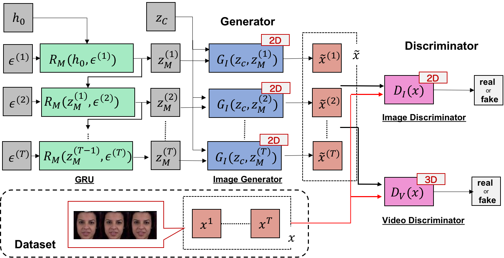

# mocogan-chainer

## Chainer implementation of MoCoGAN

This repository contains an Chainer implementation of MoCoGAN.

Paper: [MoCoGAN: Decomposing Motion and Content for Video Generation by Sergey Tulyakov, Ming-Yu Liu, Xiaodong Yang, Jan Kautz](https://arxiv.org/abs/1707.04993).

## Summary

The model can generate various videos. I used [MUG Facial Expression Database](https://mug.ee.auth.gr/fed/) to train the model. The dataset consisted of 86 subjects(51 male and 34 female) performing various facial expressins. Each video conststed of 50 to 160 frames.

In my experiment, the dataset converted to short video clips like shape of`(video_len, channel, height, width) = (16, 3, 64, 64)`. 

Model architecture of MoCoGAN is shown below.

### Result

Generated samples (1000 epoch)

### Requirements

- python3
- chainer
- pillow
- opencv
- tensorboard-chainer
- tqdm

`pip install -r requirements.txt`

### Getting started
