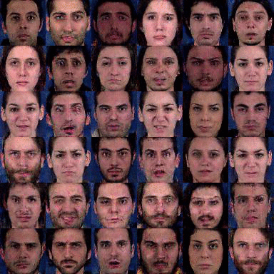

# mocogan-chainer

[](https://github.com/piyo56/mocogan-chainer/blob/master/LICENSE)
[](https://arxiv.org/abs/1707.04993)


## Chainer implementation of MoCoGAN

This repository contains an Chainer implementation of MoCoGAN.

Paper: [MoCoGAN: Decomposing Motion and Content for Video Generation by Sergey Tulyakov, Ming-Yu Liu, Xiaodong Yang, Jan Kautz](https://arxiv.org/abs/1707.04993).

## Result

Generated samples (300 epoch)

#### MUG Facial Expression Database

|normal ( *not* using label )|infogan (during the experiment)|
|---|---|
|||

## Summary

#### Dataset
MoCoGAN is one of GAN architectures for video generation. I used [MUG Facial Expression Database](https://mug.ee.auth.gr/fed/) to train the model. The dataset consisted of 86 subjects(51 male and 34 female) performing various facial expressins. Each video conststed of 50 to 160 frames.

In my experiment, the dataset converted to short video clips like shape of`(video_len, channel, height, width) = (16, 3, 64, 64)`. 

#### Architecture
The model architecture is shown below.

|MoCoGAN Architecture|
|---|
||

#### Loss Function

## Requirements

- Python >= 3.4
- OpenCV
- ffmpeg

Plese refer `requirements.txt` for required python packages.
```
pip install -r requirements.txt
```

## Getting started

__TODO__

<!--
### 0. Download dataset

- MUG Facial Expression Database: [https://mug.ee.auth.gr/fed/](https://mug.ee.auth.gr/fed/)

### 1. Preprocessing

```
python preprocess.py <dataset_name> <dataset_path> <save_path>
```

Supported `<dataset_name>`s for now are

- `mnist`
- `mug`

### 2. Training

For example, you train the normal model using mug dataset, 

```
python train.py --model normal --dataset_type mug --dataset data/dataset/mug --max_epoch 300 --batchsize 35 --save_name mug_normal
```

Training result like log, snapshot of each network is saved at `result/<save_name>`.

### 3. Monitoring with Tensorboard

Loss graph and generation results during training can be seen from Tensorboard. The data is saved at `runs/<save_name>`.

```
tensorboard --logdir=runs
```

### 4. Generating samples using trained model

```
python generate_samples.py <generater_snapshot> <save_path>
```
-->
